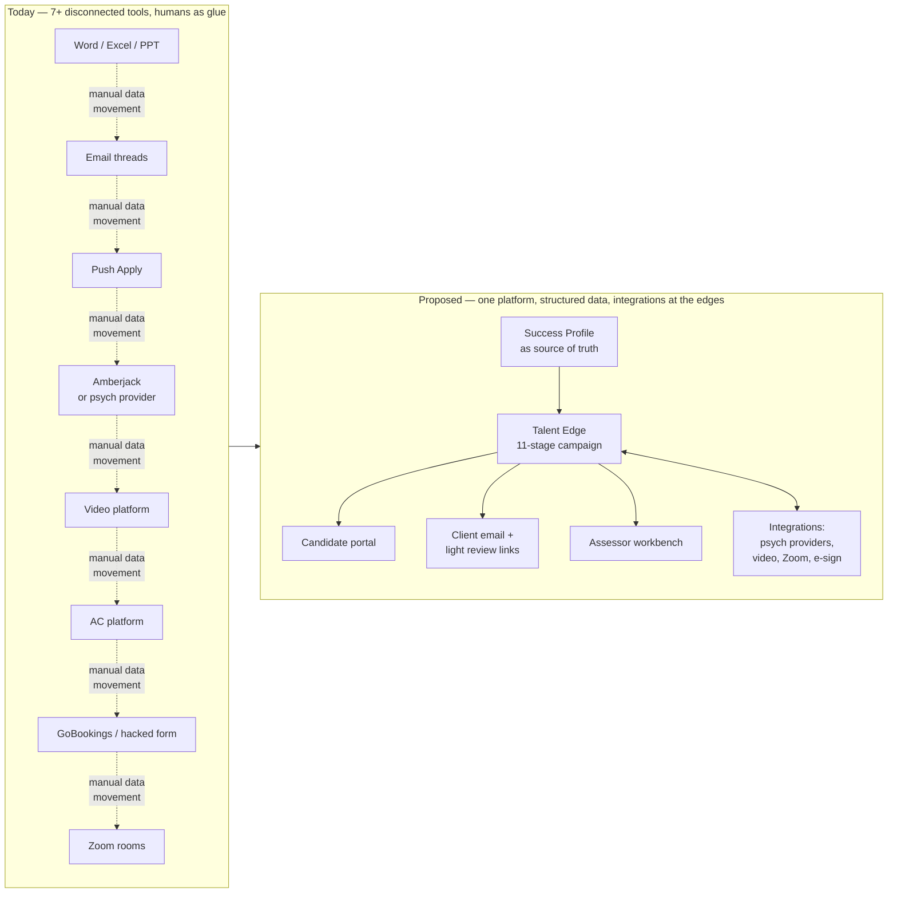
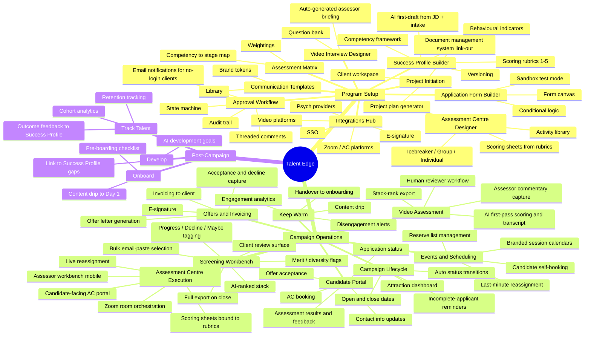
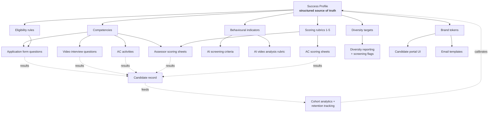

<!-- Space: TAL -->
<!-- Parent: Talent Edge -->
<!-- Parent: End to End Process Map -->
<!-- Title: Mark/Tom thoughts on E2E Process Map -->

# Talent Edge — Fusion-Aligned Product Map

**Date:** 2026-04-21 (revised)
**Status:** Draft — for Paula + Dave review
**Source input:** Paula's expanded process notes covering 11 stages (Stages 1–8 in full, Stages 9–11 named but not yet written) + prior Paula interview (lifecycle model, Amberjack gaps, ATS landscape, competitor Grad-Engage, "assess for potential not privilege").

This document is a **fork** of our existing strategy — deliberately separate from the current backlog and positioning docs. Its job is to capture what Talent Edge would look like if it were designed end-to-end around how Fusion actually runs a grad program. Once Paula and Dave have validated it, we'll fold the approved pieces back into the global strategy.

---

## 1. Narrative

**A Fusion recruiter signs a new client. Today, the next four months look like this:** Word, Excel, PowerPoint, email, Push Apply, a psych provider portal, an Assessment Centre platform, a now-defunct scheduling tool (GoBookings), Zoom rooms, and an assessor dashboard that doesn't talk to anything else. Success Profiles are Word docs. Assessment matrices are Excel tabs. Screening is done by exporting a master spreadsheet, stack-ranking applicants against a success profile, adding notes like *"Maybe — performed below average but is female and in a hard-to-recruit location"*, then emailing the spreadsheet to the client for approval. Video interview assessment is done by humans — Fusion assessors log into Amberjack and score 1-5 on every video, by hand. Assessment Centre scheduling is a manual ordeal; when candidates or assessors drop out on the morning of the day, there's a mad scramble in the platform back end to reassign seats.

**The core insight from Paula's notes:** the 11-stage campaign runs end-to-end **across seven or more tools**, most of which don't integrate, and the "glue" is a human — usually Fusion — moving data between them on spreadsheets and in email threads. Two patterns recur in every stage:

1. **Artefacts live as unstructured documents.** Success Profiles, competency frameworks, scoring rubrics, video questions, assessor briefings, email templates, screening spreadsheets — Word, Excel, PowerPoint. Because they aren't structured, nothing downstream can read them, so everything gets re-typed.
2. **Clients don't want to log in.** Push Apply has a perfectly good shortlist-sharing function. One large client used it successfully. Most others never bothered — they wanted email. "Clients don't log in" is a design constraint, not a UX failure.

**The thesis of this product map:** invert the logic. The **Success Profile** becomes the structured source of truth from Day 1. Every downstream artefact — application form questions, video questions, assessor scoring rubrics, AC activities, email templates, analytics dimensions — is either generated from it or explicitly linked to it. Human approvals become first-class in-platform workflows with email notifications attached, so clients who won't log in can still approve by clicking a link. AI accelerates first drafts at every stage — Success Profile, screening, video scoring, AC scheduling — but never makes final decisions. Humans approve.

**Design principles this document commits to:**

1. **Structured data over documents.** Competencies, behavioural indicators, and scoring rubrics are first-class entities. Documents that must live outside the platform (legal contracts, shared design work) are linked from the client's document management system, not duplicated.
2. **Email-first client collaboration.** Clients get email; the email links to a light, no-login-required review surface where possible. Deep features require a login. The platform does not force clients to change behaviour.
3. **Own the candidate surface.** Unlike Push Apply, which has no candidate portal, every interaction with a candidate — application, assessment results, feedback, AC booking, offer, keep-warm — happens on a branded Talent Edge candidate experience. This is one of Paula's most explicit asks.
4. **AI as first-draft accelerator, not decision-maker.** AI generates the starting Success Profile, drafts video questions, scores screening applications, analyses video responses, proposes AC schedules — explicitly flagged as first drafts, always human-approved. This is the direct counter to Amberjack's "bespoke = extra cost" positioning.
5. **Events and scheduling are first-class.** GoBookings is gone. Fusion's current workaround (a repurposed Push Apply form) is fragile. A grad recruitment platform without native session scheduling is structurally incomplete.

**What this means for Talent Edge as a product:** we become the only platform that covers Paula's full 11-stage arc, plus the pre-Go-Live setup phase that nobody else treats as software. Stages 1–3 (Program Setup) are largely greenfield for us. Stages 4–11 are where most of our platform already lives — but several crucial capabilities (candidate portal, screening workbench, AC assessor interface, events/scheduling) are still missing.

---

## 2. The 11-stage campaign — current state at a glance

```mermaid
flowchart LR
    S1[1. Project &<br/>Planning] --> S2[2. Push Apply<br/>Setup]
    S2 --> S3[3. System<br/>Setup]
    S3 --> S4[4. Campaign<br/>Open/Close]
    S4 --> S5[5. Screening]
    S5 --> S6[6. Video<br/>Assessment]
    S6 --> S7[7. Invite to<br/>AC]
    S7 --> S8[8. Schedule<br/>AC]
    S8 --> S9[9. Deliver<br/>AC]
    S9 --> S10[10. Offers &<br/>Invoicing]
    S10 --> S11[11. Keep<br/>Warm]

    classDef setup fill:#e0e7ff,stroke:#4338ca,color:#1e1b4b
    classDef campaign fill:#fde68a,stroke:#92400e,color:#78350f
    classDef assess fill:#bbf7d0,stroke:#166534,color:#064e3b
    classDef ac fill:#fbcfe8,stroke:#9f1239,color:#500724
    classDef offer fill:#bae6fd,stroke:#075985,color:#082f49

    class S1,S2,S3 setup
    class S4,S5 campaign
    class S6 assess
    class S7,S8,S9 ac
    class S10,S11 offer
```



**Legend:** setup / campaign & screening / video assessment / assessment centre / offer & keep-warm.

Stages 1–3 happen almost entirely outside any system today. Stages 4–11 run across Push Apply, a psych provider, a video platform, an AC platform, a scheduling tool, Zoom, and email.

---

## 3. Before-and-after: where work actually lives



---

## 4. Product map — capability tree



---

## 5. Stage-by-stage gap analysis

**Priority key:**
- **P0** — demo-critical differentiator or direct answer to an Amberjack gap / Paula-named pain
- **P1** — should-have for a launch-ready platform
- **P2** — nice-to-have, post-launch

Paula's recurring approval loops (the "Fusion sends to client for approval… client amends… back to Fusion…" pattern) appear in almost every stage. Each of those is handled by the same **Approval Workflow** capability (state machine + threaded comments + email-link for no-login clients). It is implicit in every stage below; called out once here.

### Stage 1 — Project & Assessment Planning

| Step from Paula's notes | Current state | Proposed capability | Priority |
|---|---|---|---|
| "Fusion to generate a detailed project plan/timeline" | Nothing in-platform | **Project Initiation** — intake wizard generates default plan with milestones tied to go-live date | P1 |
| "Client provides competency framework, JDs, cultural fit, eligibility, diversity targets" | Nothing | **Client Workspace** — structured intake form for framework; DMS link-out for attachments | P1 |
| "Fusion generates a Candidate Success Profile" | Nothing | **AI Success Profile Builder** — JD + intake → first draft; human edits, versions, approves | **P0** |
| "Fusion generates an Assessment Matrix/map" | Nothing | **Assessment Matrix Designer** — competency × stage × scoring rubric, reads from Success Profile | **P0** |
| "Agree psych / video / AC platform" | Nothing | **Integrations Hub** with shortlist of supported providers and one-click test | P1 |
| "Draft video interview questions aligned to matrix" | Nothing | **Video Interview Designer** — question bank tagged by competency; AI suggests questions | **P0** |
| "Build a briefing for the video assessors" | Manually authored in Word | **Auto-generated assessor briefing** — derived from selected questions and linked competencies | P1 |
| "Design AC structure and activities" | PowerPoint / Word | **Assessment Centre Designer** — activity library (icebreaker / group / individual) with competency tags | **P0** |
| *(new)* "Fusion prepares a full assessor briefing delivered virtually prior to AC day, including a platform demo" | Manual Zoom briefing with screenshares | **Assessor onboarding flow** inside the assessor workbench — self-paced walkthrough + live briefing support | P1 |

### Stage 2 — Push Apply (ATS) Setup

| Step | Current state | Proposed | Priority |
|---|---|---|---|
| "Build custom application form" | Push Apply form builder (no test mode) | **Application Form Builder** — drag-drop canvas, conditional logic, all question types | **P0** |
| "Test form several times" | Had to make form live to test | **True sandbox mode** — test forms without going live; test submissions clearly segregated | **P0** |
| "Custom email templates → Word doc → upload to Push Apply" | Double-entry | **Communication Templates Library** — template library with brand tokens; approved once, used everywhere | P1 |
| "Custom recruitment process, stages, statuses" | Hard-coded in most tools | **Configurable pipeline stages** per program | P1 |
| "Custom client dashboards, view-only" | Push Apply dashboards | **Client Dashboards** — configurable tiles, read-only + commentable | P2 |

### Stage 3 — System Setup (other platforms)

| Step | Current state | Proposed | Priority |
|---|---|---|---|
| "Liaise with psych test provider" | Manual per provider | **Psych provider integrations** — prioritised shortlist (SHL, Cut-e, Saville, Revelian TBC) | P1 |
| "Test integration with Push Apply" | Manual | **Integration test harness** — send a dummy candidate through the pipe, verify data return | P1 |
| "Set up video interview platform" | Amberjack / separate provider | **Native video assessment** — already built, with AI transcript + scoring; replaces Amberjack video | ✅ have |
| "Set up AC platform: logos, branding, activities, timings, rubrics, scheduling" | Time-consuming, complex, unfriendly | Covered by **AC Designer** (Stage 1) + **AC Execution** (Stages 8–9); this is the consolidated answer | **P0** |
| "Some platforms use Zoom rooms, some have built-in video; we preferred Zoom but it meant manual room management" | Manual | **Zoom integration** — create rooms, assign candidates/assessors, move participants between rooms for activity transitions | **P0** for virtual AC |

### Stage 4 — Campaign Open / Close

| Step | Current state | Proposed | Priority |
|---|---|---|---|
| "Fusion sets open and close dates" | Push Apply | **Campaign Lifecycle** — first-class entity with hard dates; form only accessible between dates | P1 |
| "Applicants access form via URL, complete all at once or in stages" | URL only, no login | **Candidate Portal** with saved draft applications, returnable via magic link | **P0** |
| "On submission applicants get a system email" | Push Apply sends | Template-driven email from Talent Edge; white-labelled to look like client | P1 |
| "Applicants cannot amend forms once submitted, but should be able to update contact info" | Not possible in Push Apply | **Candidate Portal** — contact info editable post-submission, application fields locked | **P0** |
| "All submitted candidates auto-invited to blended assessment" | Amberjack pattern | **Auto-status transitions** — on submit, auto-invite to next stage per the configured pipeline | P1 |
| "Monitor applications started / completed / accuracy of dashboards" | Manual | **Attraction dashboard** — live funnel, location + demographic slicers, incomplete/completed ratios | P1 |
| "Monitor return of testing/video data from Amberjack; status auto-updates to 'assessment completed'" | Amberjack integration | **Integration telemetry** — show incoming provider data with health checks | P1 |
| "Send email reminders to incomplete applications" | Push Apply email | **Scheduled reminder campaigns** — configurable cadence, per-segment copy | P1 |
| "Communicate with candidates who indicate disability / neurodiversity requiring adjustments" | Manual | **Adjustment workflow** — flag in pipeline, structured notes, assigned owner | **P0** (Paula pain #2) |
| "Work with attraction providers (Seek Grad, Prosple) for invite-to-apply campaigns" | External, requires client approval | **Attraction integrations** — reporting on source-of-hire, client approval flow for paid boosts | P2 |
| *(explicit gap)* "Push Apply does not have a Candidate Portal where they can log in and see status, results, feedback" | Explicit gap | **Candidate Portal** — application status, assessment results, feedback, AC booking, offer acceptance, keep-warm content | **P0** |

### Stage 5 — Screening

| Step | Current state | Proposed | Priority |
|---|---|---|---|
| "Wait for apps to close, ensure form is closed" | Manual | Automatic at campaign close | P1 |
| "Check incomplete applications; some got to last page but didn't hit submit — manually push to submitted" | Manual | **Abandoned-at-submit rescue** — auto-flag, one-click bulk rescue with audit trail | P2 |
| "Email incomplete applicants: thanks, missed deadline" | Push Apply bulk email | **Campaign-close communications** — templated, automated | P1 |
| "Full data export into Excel and saved to client file" | Manual Excel export | **Full campaign snapshot** — archived read-only data export generated at close, retained in client workspace | P1 |
| "Export submitted applicants into master screening spreadsheet, including assessment results" | Manual | **Screening Workbench** — all submitted applicants in a single ranked table; no Excel export required | **P0** |
| "Highlight disability flags, diversity considerations, client instructions" | Excel conditional formatting | **Screening flags** — disability, diversity, "client instructed to progress", merit tier, visible as chips | **P0** |
| "Split into pools by role if required" | Excel filter | **Pool filters** in Screening Workbench | P1 |
| "Stack-rank applicants using Success Profile (eligibility + motivation + assessment results); tag Progress / Decline / Maybe with commentary" | Manual in Excel | **AI-ranked stack** reading directly from Success Profile; recruiter adjusts + tags; notes field per applicant; AI explains its recommendation | **P0** |
| "Screen on merit, then massage the shortlist to accommodate diversity targets; add notes like 'Maybe — below average but female in a hard-to-recruit location'" | Free-text Excel notes | **Merit + diversity review mode** — separate merit score from final recommendation; structured reasons, free text, audit trail | **P0** |
| "Send Excel to client for review and approval via email" | Email | **Shortlist Review surface** — email to client with a one-click review link; client can comment / approve without logging in; power users can log in for a richer view | **P0** |
| "Upload screening results into Push Apply to update statuses" | Manual upload | Automatic — approvals in the review surface write straight through | **P0** |
| "Send decline emails to those not progressing" | Push Apply bulk email | **Bulk decline with templated reasons** — already partially built (RejectModal) | ✅ partial |
| "For progressing candidates, change status to 'video screen'" | Manual bulk move | **Bulk stage transition** — already built | ✅ have |
| "Push Apply lets us paste emails into a screen to find and bulk-move candidates" | Push Apply UX | **Email-paste selection** — reproduce this pattern; it's fast and recruiters love it | P1 |
| "Push Apply has a shortlist-sharing function but most clients never logged in" | Under-used feature | **Email-first shortlist review** (see above) — don't force a login | **P0** |

### Stage 6 — Video Assessment

**Major insight:** video scoring at Fusion today is **fully manual**. Fusion assessors log into Amberjack, watch each video, score 1–5, write commentary, tag Progress / Decline / Progress with caution. Our existing AI video analysis is a **direct differentiator**, not a minor feature.

| Step | Current state at Fusion | Proposed | Priority |
|---|---|---|---|
| "Go into each applicant, watch and review each video response" | Manual assessor | **AI first-pass scoring** already built — generates transcript + competency scores + summary | ✅ have |
| "Score out of 5 and commentary against the criteria" | Manual | **Reviewer workbench** — AI scores pre-populated; human reviewer adjusts, confirms, adds commentary; side-by-side video + rubric | **P0** |
| "Overall Progress / Decline / Progress with caution tag plus commentary" | Manual | Same tag model as screening; AI proposes a tag, human confirms | **P0** |
| "Export results, stack-rank, send to client for approval, include Reserve List" | Excel + email | **Video Assessment Shortlist** reuses Screening Workbench review surface; always includes a reserve list | **P0** |

### Stage 7 — Invite to Assessment Centre

| Step | Current state | Proposed | Priority |
|---|---|---|---|
| "Invite candidates via email, schedule to correct session" | Push Apply + GoBookings (defunct) → hacked Push Apply form | **Events & Scheduling module** — native. Session calendars per program, branded, white-labelled; candidate self-booking via candidate portal | **P0** |
| "Get list of confirmed client assessors" | Email | **Assessor directory** per program; client admin can invite / confirm | P1 |
| "Check candidate bookings regularly, update attendee list, update Push Apply status" | Manual | Automatic — bookings write through to campaign state | **P0** |
| "If candidates pull out, go back to reserve list and invite someone else" | Manual email | **Reserve list management** — one-click promote from reserve, re-issue invite | **P0** |
| *(Paula's note)* "Any platform we build should have its own events section where we can create sessions and invite candidates to book in" | Explicit ask | Covered by Events & Scheduling module | **P0** |

### Stage 8 — Schedule Assessment Centre attendees

| Step | Current state | Proposed | Priority |
|---|---|---|---|
| "Upload confirmed candidate + assessor names and emails, assign to sessions" | Manual config in AC platform | **AC Scheduler** — candidate × assessor × activity assignment; reads from Events module | **P0** |
| "Auto-schedule exists but manual config usually required to assign certain candidates to certain assessors, and to ensure fair coverage" | Partial auto-schedule | **AI-assisted schedule** — proposes assignments honouring rules (no assessor sees same candidate twice, min N assessors per candidate, conflicts); human edits | **P0** |
| "Test the platform and scheduling several times before the live session" | Manual rehearsal | **Dry-run mode** — run the AC schedule against mock participants; flag conflicts | P1 |
| "Prepare attendee lists and producer-type documents (instructions, tech checks, intros)" | Word / email | **Run-sheet generator** — derived from schedule + activities; exportable | P1 |
| "Deliver assessor briefing and training" | Zoom | Already covered by **Assessor onboarding flow** (Stage 1) | P1 |
| "Challenge: assessors can change at the last minute; candidates pull out or no-show. Details are pre-loaded so there's a mad scramble in the back end and platforms throw errors" | High pain, manual | **Live reassignment** — drag-drop re-seat assessors and candidates on the day; resilient to last-minute changes; Zoom room membership updates automatically | **P0** |

### Stage 9 — Deliver Assessment Centre *(Paula's notes not yet written)*

Our synthesis, to be validated. Based on prior Paula interviews + what exists at Amberjack + existing platform.

| Proposed capability | Priority |
|---|---|
| **Assessor workbench** — mobile-friendly, per-activity scoring sheets bound to rubrics from the Success Profile, note-taking, within-session candidate switching | **P0** (Amberjack charges extra for this; we bundle) |
| **Candidate-facing AC portal** — branded virtual AC experience: instructions, prompts, videos, activity timers, navigation between "rooms" (Amberjack premium add-on; we bundle) | P1 |
| **Zoom orchestration** — create per-activity rooms, move candidates in/out as activities transition | **P0** for virtual AC |
| **Live observation dashboard** — Fusion producers see the AC in real time: who is where, which scoring sheets are complete, who is behind | P1 |
| **Calibration capture** — during debrief, capture the final per-candidate recommendation (Offer / Decline / Hold) with assessor commentary | **P0** |

### Stage 10 — Finalise Offers / Invoicing *(Paula's notes not yet written)*

| Proposed capability | Priority |
|---|---|
| **Offer letter generator** — templated, pulls from Success Profile + AC outcome + candidate record | P1 |
| **E-signature integration** (DocuSign / HelloSign / native if cheap) | P1 |
| **Offer status tracking** — pending / accepted / declined with decline reasons | ✅ have |
| **Candidate offer acceptance flow** in candidate portal | **P0** |
| **Client invoicing** — billing events (campaign setup, per-candidate, AC day, offer accepted) configurable per client contract | P2 |
| **Handover to onboarding** — accepted offers trigger pre-boarding journey | P1 |

### Stage 11 — Keep Warm *(Paula's notes not yet written)*

Grad-Engage competes here and gets traction because nothing else does. Lean in hard.

| Proposed capability | Priority |
|---|---|
| **Keep-warm content feed** on candidate portal | ✅ have |
| **Scheduled content drips** — per-cohort, personalised by role / location | **P0** |
| **Engagement analytics** — who's active, who's gone quiet | **P0** |
| **Disengagement alerts** — flag candidates showing drop-out signals pre-Day 1 | **P0** |
| **Manager-to-candidate messaging** within portal | P1 |
| **Handoff to Develop** — post-Day 1 transition, Success Profile gaps become first-year development goals | P1 |

### Post-campaign (Onboard / Develop / Track Talent)

Outside Fusion's current 11-stage scope, but still part of Paula's broader lifecycle model (Attract → Assess → Select → Offer → Keep Warm → **Onboard → Develop → Track Talent**). These are opportunities to extend what Fusion does, not requirements for the core campaign.

| Capability | Current state | Proposed | Priority |
|---|---|---|---|
| Onboarding | ❌ Gap | Pre-boarding checklist + content drip + buddy assignment | P1 |
| Development tracker | ✅ Built | Link goals back to Success Profile gaps surfaced in assessment | P1 |
| Track Talent analytics | ✅ Built | Multi-year retention; cohort outcomes fed back as signal-quality into future Success Profiles | P2 |

---

## 6. Success Profile — the data model that ties it all together



The loop at the bottom — **analytics calibrates the Success Profile** — is what makes the platform smarter over time. When we know which signals actually predicted 2-year retention, we tell the next client which indicators are high-value vs. decorative.

---

## 7. What's changed from the 2026-04-18 draft

New in this revision after Paula's expanded notes:

1. **Stage structure expanded to her full 11 stages.** Previous draft stopped at "Stage 4 — Go Live" because that's where her notes did. Stages 4–8 are now fully mapped.
2. **Candidate Portal promoted to P0.** Paula explicitly named "Push Apply has no Candidate Portal" as a gap. Previously we had this as part of lifecycle features; now it's a standalone capability with first-class treatment.
3. **Screening Workbench is a new top-level capability.** The old draft had "AI screening" as a built feature. Paula's notes reveal the real pain: Fusion today is stack-ranking in Excel, applying merit + diversity adjustments by hand, and emailing spreadsheets to clients. Our AI screening is the starting point of this workbench, not the whole thing.
4. **Video assessment sharpened as a differentiator.** Learned that video scoring at Fusion is 100% manual human work today. Our AI video analysis is a direct replacement with a human review loop. P0 reviewer workbench.
5. **Events & Scheduling is now P0.** Previously absent; Paula flagged GoBookings went out of business in 2025 and Fusion is hacking Push Apply forms as a workaround. Native sessions + branded calendars + reserve-list management is core.
6. **Assessor workbench + AC live reassignment is P0.** Paula's "mad scramble in the back end" on the day is a clear product opportunity.
7. **Client collaboration is email-first.** New design principle: Push Apply's shortlist-sharing feature went largely unused because clients don't want to log in. Our approval workflows must support "reviewed and approved via email link, no login required". Previous draft implied an in-platform portal as the primary mode.
8. **Zoom integration called out.** Fusion's strong preference for Zoom rooms over built-in video in AC platforms is a concrete integration requirement.
9. **Diversity & disability handling formalised.** Paula's "Maybe — female in a hard-to-recruit location" screening note pattern becomes a structured **Merit + Diversity review mode** with separate merit score vs. final recommendation, structured reasons, and audit trail.
10. **Stages 9–11 explicitly flagged as our synthesis pending Paula's notes.** Not invented; consistent with prior Paula interviews + the existing platform.

---

## 8. Open questions — to validate with Paula + Dave

Framed as "here's what we believe; tell us where we're wrong."

1. **Approval workflow ownership.** Own structured-artefact approvals in-platform; link out to client DMS for unstructured docs (contracts, HR legal). We're *not* building DocuSign; we'd integrate with it for legal signatures. Approvals reach clients as an email with a one-click review link — no login required for basic approve/comment; deeper review requires login. Agree?
2. **Email-first vs portal-first.** We're inferring from the Push Apply shortlist-sharing story that clients do not want another tool to log into, and that all client-facing features should be available via email link. Is this true across all client types, or is there a segment (large, complex clients) that will log in?
3. **AI Success Profile minimum input.** We're assuming a JD + short intake form (5–10 questions) is enough for an AI first draft. Realistic on Day 1?
4. **Template library.** We're assuming a library of grad program archetypes (e.g. "Big 4 professional services grad", "Gov policy grad", "Engineering grad") cloneable to 70% complete is valuable. Agree?
5. **AC candidate-facing interface as standard.** Directly counter-position against Amberjack — we bundle it. Is this a winning pitch for Fusion clients, or is it truly only valued by a minority?
6. **Psych provider shortlist.** Prioritise SHL and Cut-e first based on AU market. Right call, or add Saville / Criteria / Revelian earlier?
7. **Screening AI confidence.** Paula's current Progress / Decline / Maybe is a tri-state human judgement. Should our AI surface the same three states, or should it output a numeric rank and let the human pick the thresholds?
8. **Merit + diversity UI.** We're proposing a structured mode that separates merit score from final recommendation, with reasons captured. Is "merit score" the right separator, or is there a better framing (e.g. "raw" vs "contextualised")?
9. **Assessor workbench mobile.** Is mobile-first the right call, or do assessors always use laptops in virtual-AC settings?
10. **Stages 9–11 synthesis.** Our take on Deliver AC, Offers/Invoicing, and Keep Warm (Sections 5.9–5.11) is inferred. Would love Paula's own words before we lock these.
11. **Onboard / Develop / Track Talent scope.** We're treating these as post-campaign extensions, not core. If Fusion wants to grow into this space, the platform would need to expand. Is that a direction Fusion wants to go, or does the handover at Keep Warm stay the Fusion boundary?
12. **Commercial model impact.** If the platform automates Success Profile drafting, AC setup, screening, and scheduling, much of what Fusion charges for today (high-touch setup hours) compresses. Feature or threat? Does the commercial model shift towards platform licence + lighter services?

---

## 9. What we're explicitly *not* doing (yet)

- **Not building our own document management system.** We integrate (SharePoint, Google Drive, OneDrive, Box); we don't store Word docs natively.
- **Not building our own psych assessment instruments.** We integrate with the established providers.
- **Not building a full LMS.** Onboarding and Develop stop at the boundary where traditional L&D platforms begin.
- **Not building candidate-side CRM.** Keep Warm is narrowly scoped to engaged-but-not-yet-started candidates; we don't compete with HubSpot or Salesforce for general candidate marketing.
- **Not building video conferencing.** We integrate with Zoom rather than reinvent it.
- **Not building a generic ATS.** Everything is oriented to grad / early-career program use case. Feature, not limitation.
- **Not forcing clients to log in.** Core features are email-first with portal-deeper.

---

*End of draft.* Paste into Confluence; the ```mermaid fenced blocks render as diagrams if the Mermaid Diagrams for Confluence macro is enabled. Where mermaid isn't rendering, export each block from [mermaid.live](https://mermaid.live) as SVG. Ready to incorporate Paula + Dave feedback and roll the agreed pieces back into the global strategy and backlog.
