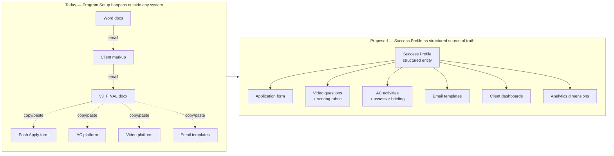
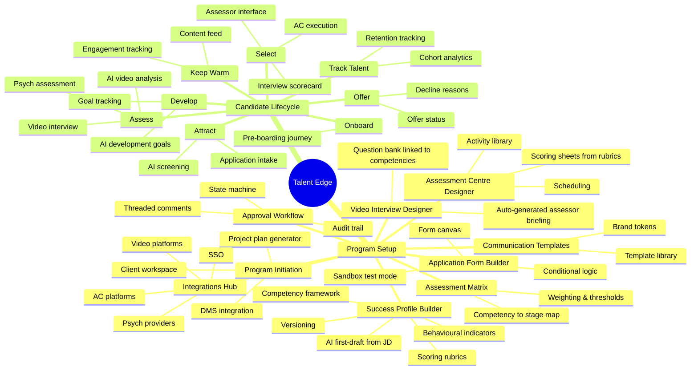
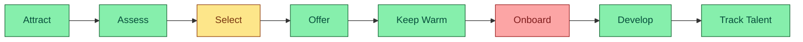
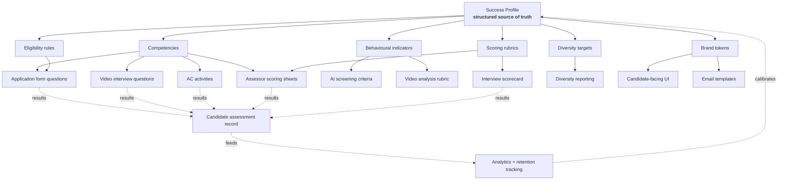

# Talent Edge — Fusion-Aligned Product Map

**Date:** 2026-04-18
**Status:** Draft — for Paula + Dave review
**Source input:** Paula's process notes (Stages 1–4; Stage 4+ intentionally deferred) + prior Paula interview (lifecycle model, Amberjack gaps, ATS landscape)

This document is a **fork** of our existing strategy — deliberately separate from the current backlog and positioning docs. Its job is to capture what Talent Edge would look like if it were designed end-to-end around how Fusion actually runs a grad program. Once Paula and Dave have validated it, we'll fold the approved pieces back into the global strategy.

---

## 1. Narrative

**A Fusion recruiter signs a new client. Today, the next four weeks look like this:** they pull open Word and Excel. They open email. They open PowerPoint. They open Push Apply. They open the psych provider's portal. They open the Assessment Centre platform. They send a draft Success Profile to the client. The client replies with tracked changes. They send `Success_Profile_v3_FINAL.docx`. They cross-reference the agreed competency framework against video interview questions, then manually copy-paste those competencies into an assessor briefing. They build an application form live in Push Apply because there's no test mode. They draft seven email templates in Word, send them for approval, then re-type them into Push Apply's editor. They upload logos into the AC platform. Then they start again for the next client.

**The core insight from Paula's notes:** almost none of Stage 1–3 happens inside a system today. The artefacts are real — Success Profiles, Assessment Matrices, video questions, assessor briefings, AC activities, application forms, email templates, dashboards — but they live in Word, Excel, PowerPoint, and email threads. And because they're unstructured documents, nothing downstream can read them. A competency framework as a Word attachment is invisible to the application form builder, the video interview scoring rubric, and the AC scorecard. They get re-typed by hand, every time.

**The thesis of this product map:** invert the logic. Make the **Success Profile** the structured source of truth from Day 1. Every downstream artefact — application form questions, video interview questions, assessor briefings, AC activities, scoring rubrics, email copy — is either generated from it or explicitly linked to it. AI accelerates the first draft; humans approve. Approvals happen as first-class in-platform workflow, not as email attachments.

**Three design principles this document commits to:**

1. **Structured data over documents.** Competencies, behavioural indicators, and scoring rubrics are first-class entities, not Word files. Documents that *do* live outside the platform (e.g. a legal contract) are linked from the client's DMS, not duplicated.
2. **In-platform approval loops.** Every artefact has an explicit state (`draft → in review → changes requested → approved`), threaded comments on specific fields, version history, and an audit trail. No more `_FINAL_v4_actually.docx`.
3. **AI as first-draft accelerator, not decision-maker.** AI generates the starting Success Profile, proposes video questions, drafts email copy, seeds assessor briefings — all explicitly flagged as first drafts, all requiring human approval before they go live. This is the direct counter to Amberjack's "bespoke = extra cost" positioning.

**What this means for Talent Edge as a product:** we become the only platform that covers the full arc Paula named — *Attract → Assess → Select → Offer → Keep Warm → Onboard → Develop → Track Talent* — plus the pre-Go-Live setup phase that nobody else treats as software. The pre-Go-Live phase is largely greenfield for us; the candidate lifecycle is where we've already built.

---

## 2. Product Map (Capability Tree)

The platform splits into two phases. **Program Setup** covers Paula's Stages 1–3 and is mostly greenfield — almost nothing here exists in Talent Edge today. **Candidate Lifecycle** covers Paula's Stage 4+ and is where most of our current platform lives.

### Current-state vs proposed-state (Program Setup)

### Capability tree

### 2a — Program Setup (greenfield)

| Capability | What it is | Why Paula needs it |
|---|---|---|
| **Program Initiation** | Client workspace, project plan/timeline generator, DMS integration (SharePoint / Google Drive / OneDrive link-out) | *"Fusion to generate a detailed project plan/timeline… Sends to client for approval."* Today this is a Word doc + email loop. |
| **Success Profile Builder** | Structured competency framework, behavioural indicators, scoring rubrics. AI drafts a starting version from the JD + a short intake form; human approves. Versioned per program year. | *"This process happens manually, outside of systems… It would be great to have this integrated… If a recruiter enters all the info (maybe prompted by AI?) the system should generate a recommended candidate profile."* Directly Paula's ask. |
| **Assessment Matrix Designer** | Maps each competency → which stage(s) assess it → how it's scored. Reads from the Success Profile. | *"Fusion generates a Candidate Success Profile and Assessment Matrix/map to clearly show the behavioural indicators to be looked for and at which stage."* |
| **Application Form Builder** | Drag-drop form canvas with conditional logic, file upload, multiple question types. **True sandbox mode** so forms can be tested without going live. Starts from a library of common grad screening questions. | *"Push Apply has no test function for the app form so we had to make the form live in order to test it."* Painful workaround today. |
| **Video Interview Designer** | Question bank mapped to competencies. System auto-generates the assessor briefing (what to look for, 1–5 scoring, how to write feedback) from the linked competencies — no re-typing. | *"Fusion to draft appropriate video interview questions aligned to the agreed matrix… then build a briefing for the video assessors."* Briefing is derived, not authored. |
| **Assessment Centre Designer** | Library of reusable activities (icebreaker / group / individual). Activities carry their competency tags and 1–5 scoring rubrics derived from the Success Profile. Scheduling for candidates + assessors. | *"Most AC systems aren't very user-friendly when it comes to building out custom activities… scheduling candidates and assessors is also painful."* |
| **Communication Templates Library** | Template library for the standard set of grad comms (app received, invitation to video, invitation to AC, offer, reject, keep-warm). Brand tokens (logo, colours) applied automatically. | *"Fusion Team creates custom email communication templates and sends to client for approval (word doc)… then uploads templates to Push Apply."* Double-entry today. |
| **Integrations Hub** | Managed integrations with the most common psych providers, video platforms, AC platforms, and SSO. | *"Fusion to liaise with Psych Test provider… test the provider integration with Push Apply."* |
| **Approval Workflow** | Every structured artefact (Success Profile, Matrix, form, email template, AC activities) has `draft → in review → changes requested → approved`, threaded comments on specific fields, version diff, audit trail. | Applies to every "Sends to client for approval" moment in her notes — which is most of them. |

### 2b — Candidate Lifecycle (mostly built)

Paula's lifecycle model maps directly onto what we've already shipped. The gaps are concentrated in the **Select** and **Onboard** phases.

| Phase | What we have | Gaps |
|---|---|---|
| **Attract** | Application intake, AI screening summary, pipeline stages, candidate search | — |
| **Assess** | Assessment timeline, video interview (live recording + AI transcript + competency scoring) | Psych provider integration is stubbed |
| **Select** | Interview scorecard on candidate profile | **Assessor interface** for AC execution (mobile-friendly, scoring sheets, note-taking); **AC scheduling** (candidate × assessor × activity); optional **candidate-facing AC interface** (Amberjack's premium add-on — we could make this standard) |
| **Offer** | Offer status tracking (pending / accepted / declined), decline reasons | Offer letter generation + e-sign |
| **Keep Warm** | Keep-warm content feed on profile, engagement hints | This is where **Grad-Engage** competes — we should lean in hard here |
| **Onboard** | *(nothing)* | Pre-boarding journey (checklist, content drip, buddy assignment, Day 1 readiness) |
| **Develop** | AI-generated development goals, goal tracking | Link development goals back to the Success Profile so "weak on Drive in AC" → "growth plan for Drive in year 1" |
| **Track Talent** | Cohort analytics (funnel, score bands, time in stage, score by track) | Multi-year retention tracking; linking graduate outcomes back to assessment signals (closing the loop) |

---

## 3. Gap Analysis — Feature List

**Priority key:**
- **P0** — demo-critical differentiator or direct answer to an Amberjack gap
- **P1** — should-have for a launch-ready platform
- **P2** — nice-to-have, post-launch

### Program Setup (Stages 1–3)

| Step from Paula's notes | Current state | Proposed capability | Priority |
|---|---|---|---|
| "Fusion to generate a detailed project plan/timeline" | Nothing in-platform | **Program Initiation** — wizard that captures client intake + generates a default project plan with milestones aligned to go-live date | P1 |
| "Client provides competency framework, JDs, cultural fit, eligibility, diversity targets" | Nothing | **Client Workspace + DMS integration** — link to SharePoint / GDrive folders; structured intake form for the framework itself | P1 |
| "Fusion generates a Candidate Success Profile" | Nothing | **AI Success Profile Builder** — JD + intake form → first draft. Human edits, versions, approves. | **P0** |
| "Fusion generates an Assessment Matrix/map" | Nothing | **Assessment Matrix Designer** — competency × stage × scoring rubric. Reads from Success Profile. | **P0** |
| "Approval loop until finalised" (happens 6× in her notes) | Email ping-pong | **Approval Workflow** — state machine + field-level comments + version history. Reused for every artefact below. | **P0** |
| "Agree psych / video / AC platform" | Nothing | **Integrations Hub** — managed list of supported providers with one-click test | P1 |
| "Draft video interview questions aligned to matrix" | Nothing | **Video Interview Designer** — question bank tagged by competency; AI suggests questions from matrix | **P0** |
| "Build a briefing for the video assessors" | Manually authored in Word | **Auto-generated assessor briefing** — derived from selected questions + linked competencies; editable but not re-typed | P1 |
| "Design AC structure and activities" | PowerPoint / Word | **Assessment Centre Designer** — activity library with competency tags + scoring sheets derived from rubrics | **P0** |
| "Build custom application form" | Push Apply form builder (no test mode) | **Application Form Builder with sandbox** — drag-drop canvas, conditional logic, test mode that doesn't go live | **P0** |
| "Test form several times → client approval → live" | Had to make form live to test | Covered by sandbox above | **P0** |
| "Custom email templates → Word doc approval → upload" | Double-entry (Word → Push Apply) | **Communication Templates Library** — template library with brand tokens; approval workflow reused | P1 |
| "Custom recruitment process / stages / statuses" | Hard-coded in most tools | **Configurable pipeline stages** per client program | P1 |
| "Custom client dashboards (view-only)" | Push Apply dashboards | **Client Dashboards** — configurable tiles, read-only + comment capability | P2 |
| "Upload logos and branding to AC platform" | Manual, every client, every platform | **Brand token library** — set once per client, applied everywhere | P2 |

### Candidate Lifecycle (Stage 4+)

| Capability | Current state | Proposed work | Priority |
|---|---|---|---|
| AI application screening | ✅ Built | — | — |
| Psych assessment integration | ⚠️ Stubbed in UI | Real integration with top 2 providers (to confirm which — likely SHL + Cut-e based on AU market) | P1 |
| Video interview (recording + AI analysis) | ✅ Built (Groq Whisper + deterministic scoring) | Replace deterministic scoring with real LLM scoring against Success Profile rubric | P1 |
| Assessor interface for AC | ❌ Gap | **Mobile-friendly assessor interface** — activity list, scoring sheets bound to matrix, notes | **P0** (Amberjack charges extra for this; we make it standard) |
| AC scheduling | ❌ Gap | Candidate × assessor × activity scheduling, with conflict detection | **P0** |
| Candidate-facing AC interface | ❌ Gap | Branded candidate portal for virtual AC days (Amberjack's premium add-on) | P1 |
| Interview scorecard | ✅ Built | Wire scores back to Success Profile so they feed analytics | P1 |
| Offer letter generation | ❌ Gap | Templated offer letter + e-sign integration | P2 |
| Offer status tracking | ✅ Built | — | — |
| Keep Warm feed | ✅ Built | Scheduled content drips, engagement analytics, alerts on disengagement (direct Grad-Engage counter) | **P0** |
| Onboarding | ❌ Gap | Pre-boarding checklist + content drip + buddy assignment | P1 |
| Development tracker | ✅ Built | Link goals back to Success Profile weaknesses surfaced in assessment | P1 |
| Analytics | ✅ Built | Multi-year retention; cohort outcomes fed back as signal quality into future Success Profiles | P2 |

---

## 4. Success Profile — the data model that ties it all together

The loop at the bottom — **analytics calibrates the Success Profile** — is what makes the platform smarter over time. When we know which signals actually predicted 2-year retention, we can tell the next client which indicators are high-value vs. decorative.

---

## 5. Open Questions — to validate with Paula + Dave

Framed as "here's what we believe; tell us where we're wrong."

1. **Approval workflow ownership.** Our current thinking is to own structured-artefact approvals in-platform, and *link out* to client DMS (SharePoint / GDrive / OneDrive) for unstructured docs (contracts, HR legal). We're **not** building DocuSign — we'd integrate with it where legal signatures are required. Agree?
2. **AI Success Profile minimum input.** We're assuming a JD + short intake form (5–10 questions) is enough for an AI first draft. Is that realistic on Day 1 with most Fusion clients, or do they typically have more / less to hand?
3. **Template vs bespoke.** We're assuming a library of grad program archetypes (e.g. "Big 4 professional services grad", "Gov policy grad", "Engineering grad") that clients clone-and-edit gets us 70% of the way to a finished Success Profile. Is that a fair assumption?
4. **AC candidate interface as standard.** We're proposing to include the candidate-facing AC portal as standard, not a premium add-on (directly counter-positioning against Amberjack). Do Fusion clients see enough value in it that this is a winning pitch, or is it truly only valued by a minority?
5. **Psych provider shortlist.** We're planning to prioritise SHL and Cut-e for the first two integrations based on the AU market. Is that the right call, or are there others (Saville, Criteria, Revelian) you'd push up the list?
6. **Onboarding scope.** We're treating onboarding as "pre-boarding up to Day 1 + first week" — *not* a full LMS. Does that align with how Fusion / clients think about the handover, or is there an expectation we go deeper into ongoing L&D?
7. **Stage 4+ from Paula's notes.** Her process doc stops at "Stage 4 - Go Live". Section 2b above is our synthesis of what the post-Go-Live side should look like, based on prior conversations and the existing platform. Would love her to sanity-check it in her own language.
8. **Commercial model impact.** If the platform automates Success Profile drafting, AC setup, and form building, a lot of what Fusion charges for today (high-touch setup hours) gets compressed. Is that a feature or a threat? Does the commercial model shift towards platform licence + lighter services, and is that a shift Fusion wants?

---

## 6. What we're explicitly *not* doing (yet)

To keep scope honest:

- **Not building our own DMS.** We integrate; we don't store Word docs natively.
- **Not building our own psych assessment instruments.** We integrate with the established providers — Paula has already signalled clients trust the incumbent instruments.
- **Not building a full LMS.** Onboarding and Develop stop at the boundary where traditional L&D platforms begin.
- **Not building candidate-side CRM.** Keep Warm is narrowly scoped to engaged-but-not-yet-started candidates; we don't compete with HubSpot or Salesforce for general candidate marketing.
- **Not building a generic ATS.** Everything we build is oriented to the grad / early-career program use case. This is a feature, not a limitation.

---

*End of draft.* Paste into Confluence; the mermaid code fences will render as diagrams if the mermaid macro is enabled. Ready to incorporate feedback from Paula and Dave and roll the agreed pieces back into the global strategy and backlog.
